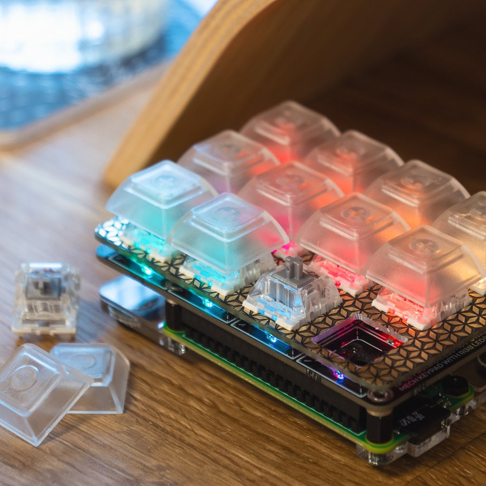

Kiwi
----

Kiwi – **K**eyboard **I**nterface for **W**ireless **I**nteraction – is a [Nerves](https://github.com/nerves-project)-based firmware for [Pimoroni](https://github.com/pimoroni)'s [Keybow](https://learn.pimoroni.com/keybow) that enables the device to connect via WiFi and control other devices and services through customizable API calls.


*Photo by Pimoroni*

## Requirements

- WiFi
- Pimoroni Keybow
- An empty microSD card
- A GitHub account
- Elixir installed on your computer

## Installation

```bash
$ git clone https://github.com/mrusme/kiwi.git
$ cd kiwi
$ make dependencies
```

Insert microSD card into the SDcard reader of your computer and find its block device, e.g. /dev/disk3 (on a Mac), unmount it and use its raw version:

```bash
$ diskutil umountDisk /dev/disk3
$ NERVES_NETWORK_KEY_MGMT=WPA-PSK NERVES_NETWORK_SSID=yourWifiNetworkName NERVES_NETWORK_PSK=yourWiFiPassword SD_CARD=/dev/rdisk3 make sdcard
```

Eject the SDcard, insert it into your Keybow's Raspberry Pi Zero and connect it to a power source.

## Configuration

As soon as the device has booted it should be connected to the WiFi. If it isn't you probably screwed up `NERVES_NETWORK_KEY_MGMT`, `NERVES_NETWORK_SSID` and/or `NERVES_NETWORK_PSK` and need to re-run the installation with correct values. Sorry.

Check your WiFi access point's web-interface to find out the IP address that was assigned to your Keybow. As soon as you found the IP you can start configuring the device via it's API.

### API

The Kiwi API is accessible via `http://10.10.10.10:8080/` (where `10.10.10.10` is the IP address of the Keybow in your WiFi).

#### Endpoint: Settings

The Kiwi API provides a `/settings` endpoint for configuring each individual key of the device.

##### **POST** `/settings/:key`

`:key` can be one of the following values:

- `key_1_in_row_1`
- `key_2_in_row_1`
- `key_3_in_row_1`
- `key_1_in_row_2`
- `key_2_in_row_2`
- `key_3_in_row_2`
- `key_1_in_row_3`
- `key_2_in_row_3`
- `key_3_in_row_3`
- `key_1_in_row_4`
- `key_2_in_row_4`
- `key_3_in_row_4`

The key names relate to the position of the key on the Keybow when the device is in front of you with the `Keybow` label in the top right corner and the pimoroni.com/keybow url on the bottom right. In order to get a clear idea, have a look at the following graphic:

```
                                             Keybow
╔════════════════╦════════════════╦════════════════╗
║                ║                ║                ║
║                ║                ║                ║
║ key_1_in_row_1 ║ key_2_in_row_1 ║ key_3_in_row_1 ║
║                ║                ║                ║
║                ║                ║                ║
╠════════════════╬════════════════╬════════════════╣
║                ║                ║                ║
║                ║                ║                ║
║ key_1_in_row_2 ║ key_2_in_row_2 ║ key_3_in_row_2 ║
║                ║                ║                ║
║                ║                ║                ║
╠════════════════╬════════════════╬════════════════╣
║                ║                ║                ║
║                ║                ║                ║
║ key_1_in_row_3 ║ key_2_in_row_3 ║ key_3_in_row_3 ║
║                ║                ║                ║
║                ║                ║                ║
╠════════════════╬════════════════╬════════════════╣
║                ║                ║                ║
║                ║                ║                ║
║ key_1_in_row_4 ║ key_2_in_row_4 ║ key_3_in_row_4 ║
║                ║                ║                ║
║                ║                ║                ║
╚════════════════╩════════════════╩════════════════╝
                                pimoroni.com/keybow
```

###### HTTP actions

In order to configure the first key of the first row to perform a HTTP post to [IFTTT's Maker Webhooks](https://ifttt.com/maker_webhooks) (click *Documentation* on that site) when it's pressed (down), run the following command:

```sh
curl -X POST "http://10.10.10.10:8080/settings/key_1_in_row_1" \
    -H "Content-Type: application/json; charset=utf-8" \
    -d $'{
          "object": {
            "keydown": {
              "http": {
                "body": "{}",
                "method": "post",
                "headers": {
                  "content-type": "application/json"
                },
                "url": "https://maker.ifttt.com/trigger/key_1_in_row_1/with/key/your-ifttt-key-here"
              }
            }
          }
        }'
```

As soon as the command returns with HTTP status code `200 OK` the key was set up and its configuration stored to the Keybow's internal storage (which is the SDcard, of course). You can now press the key (the first one on the top left) to run the HTTP call.

###### LED actions

Of course you can also do crazy things with the integrated LEDs your Keybow has. In order to configure a fancy key-press light-animation, run the following command:

```sh
curl -X POST "http://10.10.10.10:8080/settings/key_1_in_row_1" \
     -H 'Content-Type: application/json; charset=utf-8' \
     -d $'{
          "object": {
            "keydown": {
              "led": {
                "frames": [
                  {
                    "sleep": 50,
                    "keys": {
                      "key_1_in_row_1": {
                        "brightness": 255,
                        "red": 55,
                        "blue": 0,
                        "green": 0
                      }
                    }
                  },
                  {
                    "sleep": 50,
                    "keys": {
                      "key_1_in_row_1": {
                        "brightness": 255,
                        "red": 155,
                        "blue": 0,
                        "green": 0
                      }
                    }
                  },
                  {
                    "sleep": 50,
                    "keys": {
                      "key_1_in_row_1": {
                        "brightness": 255,
                        "red": 255,
                        "blue": 0,
                        "green": 0
                      }
                    }
                  },
                  {
                    "sleep": 50,
                    "keys": {
                      "key_1_in_row_1": {
                        "brightness": 255,
                        "red": 155,
                        "blue": 0,
                        "green": 0
                      }
                    }
                  },
                  {
                    "sleep": 50,
                    "keys": {
                      "key_1_in_row_1": {
                        "brightness": 255,
                        "red": 55,
                        "blue": 0,
                        "green": 0
                      }
                    }
                  },
                  {
                    "sleep": 0,
                    "keys": {
                      "key_1_in_row_1": {
                        "brightness": 255,
                        "red": 0,
                        "blue": 0,
                        "green": 0
                      }
                    }
                  }
                ]
              }
            }
          }
        }'
```

When you now press the key, it should light up in red and quickly fade off. As you can see, `frames` is an array of animation frames containing the duration between each frame (`sleep`) and the `keys` that should be targeted. You can even specify multiple keys by adding them to the `keys` object.

###### Combined actions

Actions can be combined by adding all desired action to the JSON, e.g.:

```sh
curl -X "POST" "http://10.0.0.219:8080/settings/key_2_in_row_1" \
     -H 'Content-Type: application/json; charset=utf-8' \
     -d $'{
          "object": {
            "keydown": {
              "led": { ... },
              "http": { ... }
            }
          }
        }'
```

#### Caution

There is no validation in place at the moment. If you misspell things inside the JSON or screw up the structure, the configuration might still be saved successfully but the key press won't work.

## Development

Here's some useful information if you might want to start contributing to this project yourself and want to save yourself from having to browse the official (undocumented!) Keybow's firmware code.

### Hardware information

#### Keybow keyboard GPIO pin IDs

```
          Keybow
╔════╦════╦════╗
║ 20 ║ 16 ║ 26 ║
╠════╬════╬════╣
║  6 ║ 12 ║ 13 ║
╠════╬════╬════╣
║ 22 ║ 24 ║  5 ║
╠════╬════╬════╣
║ 17 ║ 27 ║ 23 ║
╚════╩════╩════╝
```

#### LED bitstring

- 4 bytes padding at the beginning
- 4 btyes per LED: `brightness?, blue, green, red`
- 4 bytes padding at the end

```elixir
[
    0,0,0,0,      

    255,0,0,0, 
    255,0,0,0, 
    255,0,0,0, 
    255,0,0,0, 
    255,0,0,0, 
    255,0,0,0, 
    255,0,0,0, 
    255,0,0,0, 
    255,0,0,0, 
    255,0,0,0, 
    255,0,0,0, 
    255,0,0,0,      

    255,255,255,255
]
```

## Kudos to ...

- [@pimoroni](https://github.com/pimoroni) for their awesome hardware

## "Let me tell you..."

Sure, [tell me](https://twitter.com/intent/tweet?text=@mrusme%20regarding%20Kiwi,%20let%20me%20tell%20you%20that...)!
