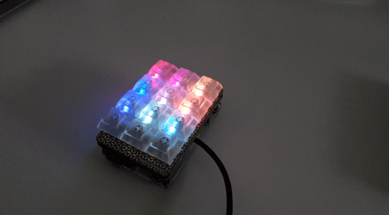

Kiwi
----

Kiwi – **K**eyboard **I**nterface for **W**ireless **I**nteraction – is a [Nerves](https://github.com/nerves-project)-based firmware for [Pimoroni](https://github.com/pimoroni)'s [Keybow](https://learn.pimoroni.com/keybow) that enables the device to connect via WiFi and control other devices and services through customizable API calls.


## Requirements

- WiFi
- Pimoroni Keybow
- An empty microSD card

## Installation

- Download the latest firmware (`kiwi.fw.zip`) from the [releases page](https://github.com/mrusme/kiwi/releases/latest) and unzip it
- Insert the microSD card into the card reader of your computer
- Raw-copy the firmware to your microSD card, e.g. using `dd`: `sudo dd bs=1m if=./kiwi.fw of=/dev/SDCARD_DEVICE` (where `SDCARD_DEVICE` is your microSD card, e.g. `/dev/rdisk3`)
- If your computer did not automatically mount a partition (`BOOT-A`) from the microSD card after the copy has finished, eject the card and plug it back in
- Open the folder of your mounted partition (`BOOT-A`) and create a file named `wifi.txt` (small caps, no spaces) with [the following content in it](wifi.txt).
- Adjust the SSID, the PSK and – in most cases this doesn't need to be adjusted – the KEY_MGMT values according to your WiFi configuration
- Save the file and unmount the partition
- Insert the microSD card into your Keybow and connect it to a power source
- Check your WiFi access point's web-interface to find out the IP address that was assigned to your Keybow

## Configuration

As soon as you found the IP you can start configuring the device via its API. See next chapters.

## API

The Kiwi API is accessible via `http://10.10.10.10:8080/` (where `10.10.10.10` is the IP address of the Keybow in your WiFi).

Side note: All example API calls in this documentation are being performed using [`curl`](https://curl.haxx.se), as it's available for the majority of platforms. However, if you prefer an easier tool for your specific platform, you can check the following:

- [Paw](https://paw.cloud) (MacOS)
- [Postman](https://www.getpostman.com/downloads/) (MacOS, Linux, Windows)
- [Insomnia](https://insomnia.rest/download/) (MacOS, Linux, Windows)
- [Swagger Inspector](https://inspector.swagger.io/) (web browser)

### Endpoint: Settings

The Kiwi API provides a `/settings` endpoint for configuring each individual key.

#### **GET** `/settings`

Retrieve a list of all currently configured settings (e.g. for backing up your current configuration).

```sh
curl "http://10.10.10.10:8080/settings" \
     -H 'Content-Type: application/json; charset=utf-8' \
     -d $'{}'
```

#### **POST** `/settings`

Bulk upsert endpoint, allows upserting a list of settings (e.g. for recovery of a backup). Note that this endpoint does no settings syntax check, meaning that individual settings for LED animations or key configs get saved without validation. Hence this endpoint should only be used for importing configuration that was already validated once (e.g. importing a backup).

```sh
curl -X "POST" "http://10.10.10.10:8080/settings" \
     -H 'Content-Type: application/json; charset=utf-8' \
     -d $'{
          "settings": [
            {
              "id": "key_1_in_row_1",
              "object": {
                "keydown": {
                  "http": [

                    ...

                  ]
                }
              }
            },
            {
              "id": "animation_main",
              "object": {
                "frames": [

                    ...

                ]
              }
            }
          ]
        }'
```

#### **GET** `/settings/keys`

Retrieve a list of all currently configured keys.

```sh
curl "http://10.10.10.10:8080/settings/keys" \
     -H 'Content-Type: application/json; charset=utf-8' \
     -d $'{}'
```

#### **GET** `/settings/keys/:key`

Retrieve the current configuration for a specific key.

```sh
curl "http://10.10.10.10:8080/settings/keys/key_1_in_row_1" \
     -H 'Content-Type: application/json; charset=utf-8' \
     -d $'{}'
```

#### **POST** `/settings/keys/:key`

`:key` can be one of the following values:

- `key_1_in_row_1`
- `key_2_in_row_1`
- `key_3_in_row_1`
- `key_1_in_row_2`
- `key_2_in_row_2`
- `key_3_in_row_2`
- `key_1_in_row_3`
- `key_2_in_row_3`
- `key_3_in_row_3`
- `key_1_in_row_4`
- `key_2_in_row_4`
- `key_3_in_row_4`

The key names relate to the position of the key on the Keybow when the device is in front of you with the `Keybow` label in the top right corner and the pimoroni.com/keybow url on the bottom right. In order to get a clear idea, have a look at the following graphic:

```
                                             Keybow
╔════════════════╦════════════════╦════════════════╗
║                ║                ║                ║
║                ║                ║                ║
║ key_1_in_row_1 ║ key_2_in_row_1 ║ key_3_in_row_1 ║
║                ║                ║                ║
║                ║                ║                ║
╠════════════════╬════════════════╬════════════════╣
║                ║                ║                ║
║                ║                ║                ║
║ key_1_in_row_2 ║ key_2_in_row_2 ║ key_3_in_row_2 ║
║                ║                ║                ║
║                ║                ║                ║
╠════════════════╬════════════════╬════════════════╣
║                ║                ║                ║
║                ║                ║                ║
║ key_1_in_row_3 ║ key_2_in_row_3 ║ key_3_in_row_3 ║
║                ║                ║                ║
║                ║                ║                ║
╠════════════════╬════════════════╬════════════════╣
║                ║                ║                ║
║                ║                ║                ║
║ key_1_in_row_4 ║ key_2_in_row_4 ║ key_3_in_row_4 ║
║                ║                ║                ║
║                ║                ║                ║
╚════════════════╩════════════════╩════════════════╝
                                pimoroni.com/keybow
```

##### HTTP actions

HTTP actions allow you to run arbitrary HTTP requests (`GET`, `PUT`, `POST`, `DELETE`) in order to control basically everything that provides a more or less sane HTTP API, like IoT devices or web services. Let's have a look at an example:

In order to configure the first key of the first row to perform a HTTP post to [IFTTT's Maker Webhooks](https://ifttt.com/maker_webhooks) (click *Documentation* on that site) when it's pressed (down), run the following command:

```sh
curl -X POST "http://10.10.10.10:8080/settings/keys/key_1_in_row_1" \
    -H "Content-Type: application/json; charset=utf-8" \
    -d $'{
          "object": {
            "keydown": {
              "http": [
                {
                  "body": "{}",
                  "method": "post",
                  "headers": {
                    "content-type": "application/json"
                  },
                  "url": "https://maker.ifttt.com/trigger/key_1_in_row_1/with/key/your-ifttt-key-here"
                }
              ]
            }
          }
        }'
```

As soon as the curl command returns with HTTP status code `200 OK` the key was set up and its configuration stored to the Keybow's internal storage (which is the micoSD card, of course). You can now press the key (the first one on the top left) to run the HTTP call.

However, you might have noticed, that the `http` property is not simply an object but rather an array containing objects. This allows you to define multiple HTTP actions to run with the press of a single button. In order to do so, simply add another HTTP request object to the `http` array:

```sh
curl -X POST "http://10.10.10.10:8080/settings/keys/key_1_in_row_1" \
    -H "Content-Type: application/json; charset=utf-8" \
    -d $'{
          "object": {
            "keydown": {
              "http": [
                {
                  "body": "{}",
                  "method": "post",
                  "headers": {
                    "content-type": "application/json"
                  },
                  "url": "https://maker.ifttt.com/trigger/turn_lights_off/with/key/your-ifttt-key-here"
                },
                {
                  "body": "{}",
                  "method": "post",
                  "headers": {
                    "content-type": "application/json"
                  },
                  "url": "https://maker.ifttt.com/trigger/power_on_television/with/key/your-ifttt-key-here"
                }
              ]
            }
          }
        }'
```

The HTTP requests defined within the `http` array are being run **one after another** (in the order defined within the array, from top to bottom) and not in parallel. This means that the second request waits for the first one to complete until it executes. Also keep in mind that, as of right now, subsequent requests don't care about their prior request's return status and will run no matter what.

##### Scripted HTTP actions (advanced topic)

Now that we've learned how HTTP requests work and that we can have multiple requests running one after another, we can dive deeper into how HTTP requests can be scripted.

Let's assume, you would like one button to trigger an API that turns a lightbulb on or off. The API accepts a boolean value as the lightbulb's state, with `true` being on, `false` being off. Now, in order to program a single button to trigger the lightbulb on **and** off with each keypress, you need to have a dynamic value within your request's body, that changes, depending on the current state of the lightbulb. This state could be retrieved inside a separate HTTP `GET` request that runs prior to the one updating the lightbulb's status.

Kiwi allows you to do just this. Let's have a look on how such a `http` definition could look like for a Philips Hue connected lightbulb:

```sh
curl -X "POST" "http://10.10.10.10:8080/settings/keys/key_1_in_row_1" \
     -H 'Content-Type: application/json; charset=utf-8' \
     -d $'{
          "object": {
            "keydown": {
              "http": [
                {
                  "body": "{}",
                  "method": "get",
                  "headers": {
                    "content-type": "application/json"
                  },
                  "url": "http://YOUR-HUE-BRIDGE-IP-HERE/api/YOUR-GENERATED-USERNAME-HERE/lights/1"
                },
                {
                  "body": "{\\"on\\": <<{Map.get(previous_http_response, :body) |> Jason.decode!() |> Map.get(\\"state\\") |> Map.get(\\"on\\") |> Kernel.not}>>}",
                  "method": "put",
                  "headers": {
                    "content-type": "application/json"
                  },
                  "url": "http://YOUR-HUE-BRIDGE-IP-HERE/api/YOUR-GENERATED-USERNAME-HERE/lights/1/state"
                }
              ]
            }
          }
        }'
```

As you can see, we're doing two requests here. First, we run a `GET` request that retrieves the current status of the Hue lightbulb. In the second request then, we use the the scripted HTTP action feature within the request the body. In order to make the script identifiable to Kiwi, it needs to be surrounded by `<<{}>>`. As script language we use Elixir.

Every request that uses scripting retrieves a variable named `previous_http_response` which either contains the HTTP response of the previously executed HTTP request or `nil`. `previous_http_response` is of type [`%Mojito.Response{}`](https://github.com/appcues/mojito). In this example, we extract the `body` from the `%Mojito.Response{}` (which is a JSON string) and decode it using `Jason.decode!`. Afterwards we `Map.get` the `state` map from the decoded body map and then `Map.get` its `on` property – which is a boolean value. If `on` is `true`, it means that our light is currently turned on. If it's `false`, it means that it's currently off. Last but not least, we pipe the boolean value to `Kernel.not`, which inverts the boolean state. The the inverted state is the return of this script, will be converted to a JSON representation and used as a value in the very place our `<<{ ... }>>` is.

The result of all this: If the current state of the lightbulb is `false`, it's being inverted to `true` and set as value for the `on` property inside our request's body. The request will then execute with a JSON body that says `{"on": true}`, so that the Hue turns the lightbulb on. When we press the key another time, the `GET` request will retrieve `true` inside of `response.body.state.on` and the upcoming `PUT` request will fetch this value, invert it and send `{"on": false}`, so that the light turns back off.

Scripted HTTP actions allow you to do many fancy things with little knowledge of HTTP requests and Elixir. However keep in mind that the scripts you write are being executed within the same environment in which Kiwi runs and have pretty much the same permissions (access keys, access LEDs, access your WiFi). Hence, always make sure to validate data that you retrieve from endpoints you have no control of!

##### LED actions

Of course you can also do crazy things with the integrated LEDs your Keybow has. In order to configure a fancy key-press light-animation, run the following command:

```sh
curl -X POST "http://10.10.10.10:8080/settings/keys/key_1_in_row_1" \
     -H 'Content-Type: application/json; charset=utf-8' \
     -d $'{
          "object": {
            "keydown": {
              "led": {
                "frames": [
                  {
                    "sleep": 50,
                    "keys": {
                      "key_1_in_row_1": {
                        "brightness": 255,
                        "red": 55,
                        "blue": 0,
                        "green": 0
                      }
                    }
                  },
                  {
                    "sleep": 50,
                    "keys": {
                      "key_1_in_row_1": {
                        "brightness": 255,
                        "red": 155,
                        "blue": 0,
                        "green": 0
                      }
                    }
                  },
                  {
                    "sleep": 50,
                    "keys": {
                      "key_1_in_row_1": {
                        "brightness": 255,
                        "red": 255,
                        "blue": 0,
                        "green": 0
                      }
                    }
                  },
                  {
                    "sleep": 50,
                    "keys": {
                      "key_1_in_row_1": {
                        "brightness": 255,
                        "red": 155,
                        "blue": 0,
                        "green": 0
                      }
                    }
                  },
                  {
                    "sleep": 50,
                    "keys": {
                      "key_1_in_row_1": {
                        "brightness": 255,
                        "red": 55,
                        "blue": 0,
                        "green": 0
                      }
                    }
                  },
                  {
                    "sleep": 0,
                    "keys": {
                      "key_1_in_row_1": {
                        "brightness": 255,
                        "red": 0,
                        "blue": 0,
                        "green": 0
                      }
                    }
                  }
                ]
              }
            }
          }
        }'
```

When you now press the key, it should light up in red and quickly fade off. As you can see, `frames` is an array of animation frames containing the duration between each frame (`sleep`) and the `keys` that should be targeted. You can even specify multiple keys by adding them to the `keys` object.

##### Combined actions

Actions can be combined by adding all desired action to the JSON, e.g.:

```sh
curl -X "POST" "http://10.10.10.10:8080/settings/keys/key_2_in_row_1" \
     -H 'Content-Type: application/json; charset=utf-8' \
     -d $'{
          "object": {
            "keydown": {
              "led": { ... },
              "http": [{ ... }]
            }
          }
        }'
```

#### **GET** `/settings/animations/:animation`

Retrieve the current configuration for a specific animation.

```sh
curl "http://10.10.10.10:8080/settings/animations/animation_main" \
     -H 'Content-Type: application/json; charset=utf-8' \
     -d $'{}'
```

#### **POST** `/settings/animations/:animation`

This endpoint allows setting constantly playing LED animations on the keyboard. `:animation` defines the animation you'd like to define. By default, Kiwi loads the animation `animation_main`.

You can configure `animation_main` like this:

```sh
curl -X "POST" "http://10.10.10.10:8080/settings/animations/animation_main" \
     -H 'Content-Type: application/json; charset=utf-8' \
     -d $'{
          "object": {
            "frames": [
              {
                "sleep": 500,
                "keys": {
                  "key_1_in_row_1": {
                    "red": 255,
                    "green": 0,
                    "blue": 0
                  }
                }
              },
              ...
              ...
              ...
              ...
              ...
            ]
          }
        }'
```

Alternatively you can use [image2kiwi](https://github.com/mrusme/image2kiwi) to generate an animation from a JPG, PNG, GIF, etc. Please refer to its documentation on how image generation works. Here's the curl example of how to set a generated animation:

```sh
curl -X "POST" "http://10.0.0.219:8080/settings/animations/animation_main" \
     -H 'Content-Type: application/json; charset=utf-8' \
     -d "{\"object\": {\"frames\": $(python3 ./image2kiwi.py ./rainbow.gif) }}"
```



*Notice: image2kiwi scales the image to max 3x4px. If you pass an image that's 300x300px, its aspect will be kept and it will be scaled to 3x3px. Hence, the bottom three keys won't light up.*

## Integrations

### Philips Hue Bridge

Find the IP address of your Philips Hue Bridge on your network and create a dedicated user for Kiwi:

```sh
curl -X "POST" "http://YOUR-HUE-BRIDGE-IP-HERE/api" \
     -H 'Content-Type: application/json; charset=utf-8' \
     -d $'{
          "devicetype": "kiwi#kiwi"
        }'
```

This request will return an auto-generated username. With this you can then check all your connected lights:

```sh
curl "http://YOUR-HUE-BRIDGE-IP-HERE/api/YOUR-GENERATED-USERNAME-HERE/lights" \
     -H 'Content-Type: application/json; charset=utf-8' \
     -d $'{}'
```

After you've identified the light you'd like to turn on/off, configure two keys:

```sh
curl -X "POST" "http://10.10.10.10:8080/settings/keys/key_1_in_row_1" \
     -H 'Content-Type: application/json; charset=utf-8' \
     -d $'{
          "object": {
            "keydown": {
              "http": [{
                "body": "{\\"on\\": true}",
                "method": "put",
                "headers": {
                  "content-type": "application/json"
                },
                "url": "http://YOUR-HUE-BRIDGE-IP-HERE/api/YOUR-GENERATED-USERNAME-HERE/lights/1/state"
              }]
            }
          }
        }'
```

```sh
curl -X "POST" "http://10.10.10.10:8080/settings/keys/key_2_in_row_1" \
     -H 'Content-Type: application/json; charset=utf-8' \
     -d $'{
          "object": {
            "keydown": {
              "http": {
                "body": "{\\"on\\": false}",
                "method": "put",
                "headers": {
                  "content-type": "application/json"
                },
                "url": "http://YOUR-HUE-BRIDGE-IP-HERE/api/YOUR-GENERATED-USERNAME-HERE/lights/1/state"
              }
            }
          }
        }'
```

That's it!


**Want to turn your Philips Hue lights on and off with a single button? Check the advanced [scripted HTTP actions](#scripted-http-actions-advanced-topic) topic!**

## Development

### Requirements

- WiFi
- Pimoroni Keybow
- An empty microSD card
- A GitHub account
- Elixir installed on your computer

### Installation

Make sure to have Erlang and Elixir installed on your computer!

```bash
$ git clone https://github.com/mrusme/kiwi.git
$ cd kiwi
$ make dependencies
```

*Note: For development it makes sense that you enable the WiFi configuration block within `config/config.exs`, so that you can pass the WiFi config via environment variables during the build.*

Insert microSD card into the microSD card reader of your computer and find its block device, e.g. /dev/disk3 (on a Mac), unmount it and use its raw version:

```bash
$ diskutil umountDisk /dev/disk3
$ NERVES_NETWORK_KEY_MGMT=WPA-PSK NERVES_NETWORK_SSID=yourWifiNetworkName NERVES_NETWORK_PSK=yourWiFiPassword SD_CARD=/dev/rdisk3 make sdcard
```

Eject the microSD card, insert it into your Keybow's Raspberry Pi Zero and connect it to a power source.

## Configuration

As soon as the device has booted it should be connected to the WiFi. If it isn't you probably screwed up `NERVES_NETWORK_KEY_MGMT`, `NERVES_NETWORK_SSID` and/or `NERVES_NETWORK_PSK` and need to re-run the installation with correct values. Sorry.

Check your WiFi access point's web-interface to find out the IP address that was assigned to your Keybow. As soon as you found the IP you can start configuring the device via its API.

### Hardware information

Here's some useful information if you might want to start contributing to this project yourself and want to save yourself from having to browse the official (undocumented!) Keybow's firmware code.

#### Keybow keyboard GPIO pin IDs

```
          Keybow
╔════╦════╦════╗
║ 20 ║ 16 ║ 26 ║
╠════╬════╬════╣
║  6 ║ 12 ║ 13 ║
╠════╬════╬════╣
║ 22 ║ 24 ║  5 ║
╠════╬════╬════╣
║ 17 ║ 27 ║ 23 ║
╚════╩════╩════╝
```

#### LED bitstring

- 4 bytes padding at the beginning
- 4 bytes per LED: `brightness?, blue, green, red`
- 4 bytes padding at the end

```elixir
[
    0,0,0,0,      

    255,0,0,0, 
    255,0,0,0, 
    255,0,0,0, 
    255,0,0,0, 
    255,0,0,0, 
    255,0,0,0, 
    255,0,0,0, 
    255,0,0,0, 
    255,0,0,0, 
    255,0,0,0, 
    255,0,0,0, 
    255,0,0,0,      

    255,255,255,255
]
```

### Support this project!

#### Looking for a front-end ninja!

Currently looking for someone who would like to build a slim React or Angular web-app on top of the Kiwi API to allow people to easily configure the Keybow without lots of technical mumbo-jumbo.
If you'd be interested in contributing hit me up! :-)

## Kudos to ...

- [@pimoroni](https://github.com/pimoroni) for their awesome hardware

## "Let me tell you..."

Sure, [tell me](https://twitter.com/intent/tweet?text=@mrusme%20regarding%20Kiwi,%20let%20me%20tell%20you%20that...)!
